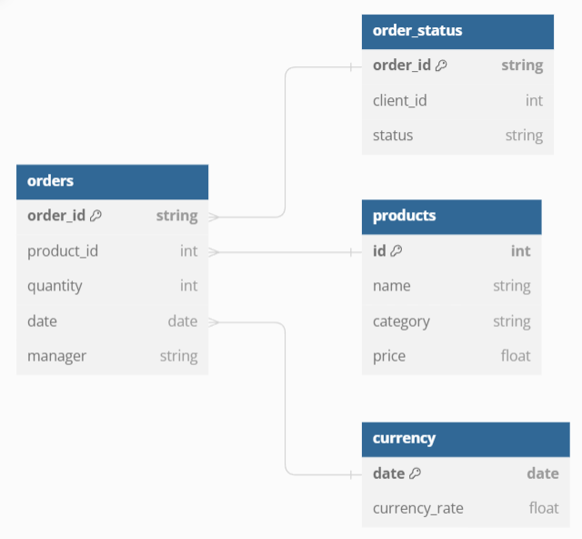

# da_project_audio_sales

## Описание проекта
Проект представляет собой анализ данных об оптовых продажах аудиотехники на основе кейса из курса KARPOV.COURSES. Исследование выполнено для компании «Карпов Саунд», которая занимается оптовой продажей аудиотехники и предлагает широкий ассортимент товаров от ведущих мировых брендов (профессиональные аудиосистемы, домашние кинотеатры, портативные аудиоустройства и аксессуары).

Компания работает с крупными розничными сетями и специализированными магазинами аудиотехники по всей России. Заказы обрабатываются через CRM-систему: клиенты оставляют заявки, менеджеры связываются для обсуждения деталей, после чего заказы подтверждаются или отменяются.

## Структура данных
Данные представлены в виде выгрузки из CRM системы в формате многоуровневой файловой структуры.

- Основная папка `data` содержит:
  - Папку `orders`, в которой находятся подпапки с датами, далее с именами менеджеров, в каждой из которых есть файлы `orders.csv` и `order_status.csv`.
    - Пример: `data -> orders -> 2024-03-01 -> Алексей Саксофонов -> orders.csv и order_status.csv`.
  - Папку `products` с категориями товаров, в каждой из которых находится файл `products.csv`.
    - Пример: `data -> products -> AV-процессор -> products.csv`.
- Файл `usd_rate.txt` с курсом доллара США на каждый день анализируемого периода (формат данных: дата, курс, валюта) для расчета выручки в рублях.

## Этапы анализа
1. Сбор, очистка и объединение данных.
2. Определение ключевых тенденций в продажах по месяцам.
3. Определение и расчет ключевых метрик.
4. Сегментация и оптимизация товарной линейки.
5. Визуализация динамики метрик по времени.
6. Анализ эффективности менеджеров по продажам.
7. Создание отчета с кратким описанием всех выполненных этапов.

## Использованные библиотеки
- `pandas`
- `matplotlib`
- `seaborn`
- `os`

## Результаты работы
1. Проведены сбор, очистка и объединение данных для их дальнейшего анализа.
2. Определены дни месяца с наибольшим количество заказов.
3. Определено распределение заказов по дням недели, построен соответствующий график.
4. Определено среднее количество заказов по дням недели, построен соответствующий график.
5. Определены дни, которые выбиваются из "сезонности" по количеству заказов, построен соответствующий график.
6. Определено отношение отмененных заказов к подтвержденным по датам, построен соответствующий график.
7. Определена причина аномалии в данных.
8. Расчитаны выручки в рублях по каждому заказу.
9. Расчитаны средний чек и количество заказов по дням, построен соответствующий график.
10. Расчитаны выручки и количество заказов по каждому бренду.
11. Определено количество невостребованных товаров у каждого бренда.
12. Исследованы распределения цены востребованных и невостребованных товаров у брендов, у которых невостребованных товаров больше половины, построен соответствующий график.
13. Расчитаны соотношения количества отмененых заказов к подтвержденным по брендам и категориям товаров, построены соответствующие графики.
14. Определены наиболее прибыльные бренды в каждой категории товаров; определены бренды в каждой категории, которые чаще всего отменялись.
15. Определена полученная и упущенная выручка по каждой категории, построены соответствующие графики.
16. Определены наиболее эффективные менеджеры по доле выручки и количеству заказов в подтвержденных заказах, построены соответствующие графики.
17. Расмотрена производительность менеджеров с точки зрения подтвержденных и отмененных заказов, расчитаны доли от суммарной выручки и количества заказов, доли для каждого менеджера (то есть доля подтвержденной выручки/кол-во заказов от общей выручки/кол-ва заказов, которую принес конкретный менеджер), построены соответствующие графики.
